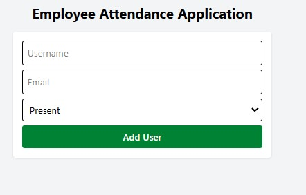

# 📋 Employee Attendance System (React CRUD)

A streamlined React application designed to manage employee attendance. This project demonstrates full **CRUD (Create, Read, Update, Delete)** functionality, state management with hooks, and form validation using Regular Expressions.

## 🚀 Features
- **Add Employee:** Register new employees with username and email.
- **Attendance Tracking:** Mark employees as 'Present' or 'Absent'.
- **Real-time Validation:** Built-in Regex checks for usernames (min 3 chars) and email formats.
- **Edit/Update:** Modify existing employee details seamlessly.
- **Delete:** Remove employee records from the database.
- **Responsive UI:** Styled with **Tailwind CSS** for a clean, modern look.

## 🛠️ Tech Stack
- **Frontend:** React.js, Tailwind CSS
- **HTTP Client:** Axios
- **Mock Backend:** JSON Server
- **Build Tool:** Vite

demo : 
